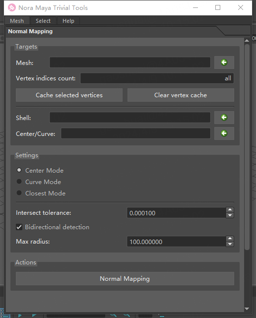
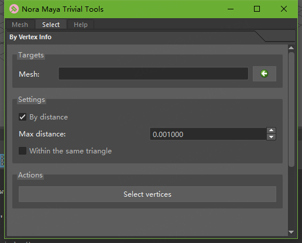

# Nora Maya Trivial Tools
 A collection of Maya trivial tools，the development environment is Maya 2024.1

------

## Installation

There are some Maya commands in the command.txt under the path. After modifying the path, copy and paste the commands into the Python source type window of the Maya script editor. Click run to execute the commands, or you can add them to the shelf by yourself.

```python
import os, sys
from importlib import reload
sys.path.append(r'D:\Git\NoraMayaTrivialTools')
import noraMayaTrivialSetup
reload(noraMayaTrivialSetup)
noraMayaTrivialSetup.NoraTrivialTools().load_window()
```

## Description

Notation：vertex position $\mathbf{x}$, vertex normal $\mathbf{n}$, center  $\mathbf{c}$, 

### Normal Mapping



This function is used to synchronize the normals of one object (usually a smooth surface) with another object.

| parameter                   | illustrate                                                   |
| --------------------------- | ------------------------------------------------------------ |
| Mesh                        | The mesh object to be operated on (can be omitted if selected vertices are cached). |
| Vertex indices count        | Cached number of vertices.                                   |
| **Cache selected vertices** | Cache selected vertices.                                     |
| Clear vertex cache          | -                                                            |
| Shell                       | The target to map to, which can be a Mesh or a Nurbs surface. |
| Center/Curve                | The center object or curve to use for mapping. (can be omitted on 'Closest Mode'). |
| Center Mode                 | The center object's coordinates are $\mathbf{c}$. The function calculate the closest intersection point between the ray starting from $\mathbf{x}$ in the direction of $\mathbf{x} - \mathbf{c}$ and the Shell. |
| Curve Mode                  | First, determine the closest point $\mathbf{c}$ on the curve to the vertex. Then, calculate the closest intersection point between the ray starting from $\mathbf{x}$ in the direction of $\mathbf{x} - \mathbf{c}$ and the Shell. |
| Closest Mode                | Select the normal of the nearest point on the Shell          |
| Intersect tolerance         | Maximum allowable error for intersection                     |
| Bidirectional detection     | Shall we also calculate the closest intersection point (inward) between the ray starting from $\mathbf{x}$ in the direction of $\mathbf{c} - \mathbf{x}$ and the Shell? |
| Max Radius                  | Maximum distance limit for intersection points, do not modify normals beyond the range |
| **Normal Mapping**          | According to the above configuration, modify the normals of Mesh |

### Element selection



Used to select elements that meet the conditions

| parameter                | illustrate                                                   |
| ------------------------ | ------------------------------------------------------------ |
| Mesh                     | Target Mesh                                                  |
| By distance              | Select based on distance                                     |
| Max distance             | Vertices with a distance smaller than this value will be selected |
| Within the same triangle | Only vertices within the same triangle with a distance smaller than this value will be selected |
| **Select vertices**      | -                                                            |


------

## 安装方法

路径下的 command.txt 有一些 Maya 命令，在修改路径后，将命令粘贴到 Maya 脚本编辑器 Python 源类型窗口，点击运行即可；也可以自行添加到工具架。

```python
import os, sys
from importlib import reload
sys.path.append(r'D:\Git\NoraMayaTrivialTools')
import noraMayaTrivialSetup
reload(noraMayaTrivialSetup)
noraMayaTrivialSetup.NoraTrivialTools().load_window()
```

## 功能说明

标记：顶点位置 $\mathbf{x}$，顶点法线 $\mathbf{n}$，

### 法线映射


此功能用于将一个物体（一半具有平滑的表面）的法线同步到另一个物体上

| 参数                        | 功能                                                         |
| --------------------------- | ------------------------------------------------------------ |
| Mesh                        | 要操作的网格对象（如果缓存了选中的顶点的话，可以缺省）       |
| Vertex indices count        | 缓存的顶点数                                                 |
| **Cache selected vertices** | 缓存选中的顶点                                               |
| **Clear vertex cache**      | 清空缓存的顶点                                               |
| Shell                       | 要映射的目标，可以是 Mesh，也可以是 Nurbs surface            |
| Center/Curve                | 映射的中心物体，或者曲线（Closest Mode 时可以缺省）          |
| Center Mode                 | 中心物体坐标为 $\mathbf{c}$，以 $\mathbf{x}$ 为起点， $\mathbf{x} - \mathbf{c}$ 为方向的射线与 Shell 计算最近的交点 |
| Curve Mode                  | 首先确定顶点到曲线的最近点 $\mathbf{c}$，以 $\mathbf{x}$ 为起点, $\mathbf{x} - \mathbf{c}$ 方向的射线与 Shell 计算最近的交点 |
| Closest Mode                | 选择 Shell 上最近的点的法线                                  |
| Intersect tolerance         | 求交精度                                                     |
| Bidirectional detection     | 是否同时向以 $\mathbf{x}$ 为起点, $\mathbf{c} - \mathbf{x}$ 方向的射线与 Shell 计算最近的交点（向内） |
| Max Radius                  | 交点最大距离限制，超出范围后不修改法线                       |
| **Normal Mapping**          | 根据上面的配置，修改 Mesh 的法线                             |

### 选择满足条件的元素


用于选择满足条件的元素

| 参数                     | 功能                                       |
| ------------------------ | ------------------------------------------ |
| Mesh                     | 操作目标网格                               |
| By distance              | 根据距离选择                               |
| Max distance             | 顶点间距离小于此值将会被选中               |
| Within the same triangle | 仅同一三角形内顶点间距离小于此值才会被选中 |
| **Select vertices**      | 执行顶点选择                               |


